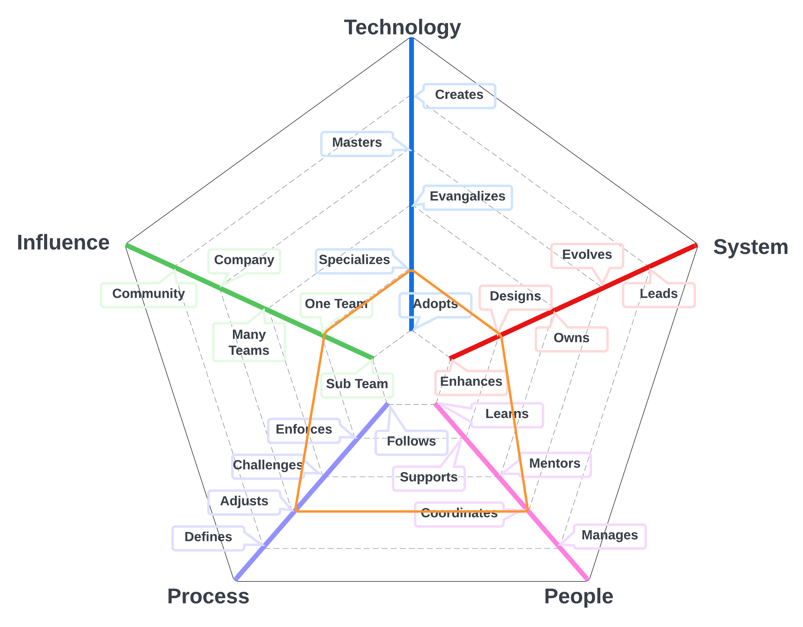
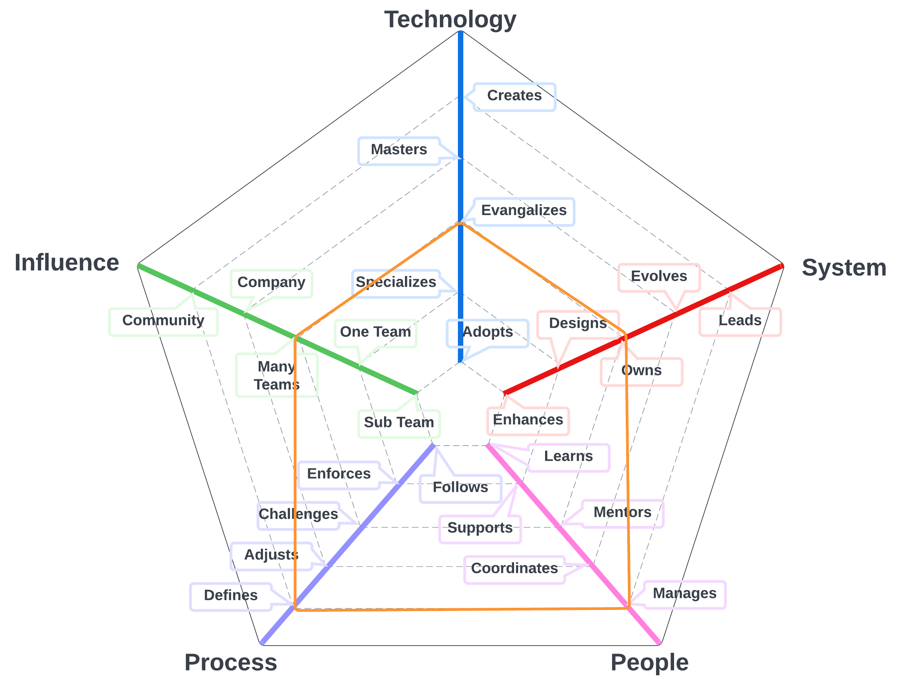
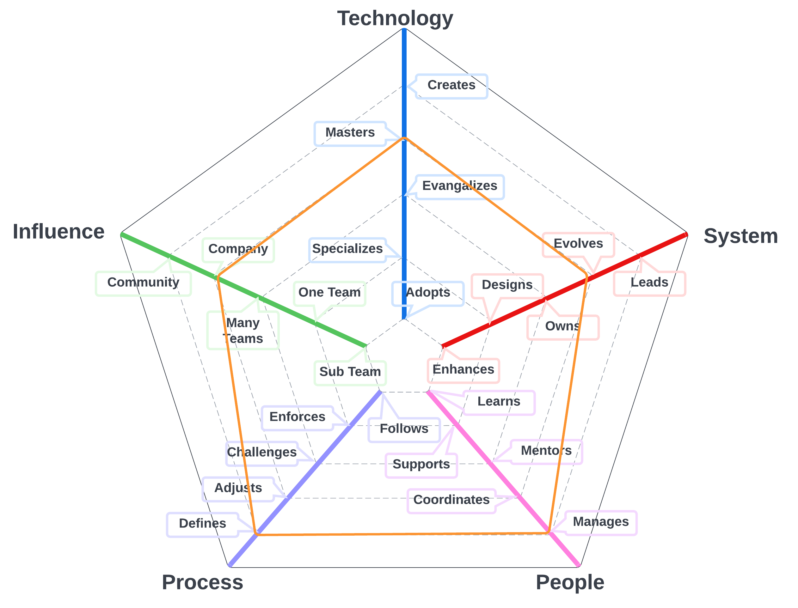

# Delivery Director
## Summary
Director of Delivery Engineering with expertise in guiding teams to ensure successful execution of software development projects. Fosters a culture of efficiency and continuous improvement, streamlines project delivery processes, and mentors team members for professional growth. Proficient in embracing industry best practices and Agile methodologies, prioritizing timely delivery, resource optimization, and user experience. Committed to nurturing collaboration, promoting effective communication, and bridging the gap between technical and non-technical stakeholders for informed decision-making and organizational success.

## Details
Director of Delivery Engineering, a seasoned leader and project management expert, adept at overseeing and guiding delivery engineering teams to ensure the successful execution of software development projects. This strategic role involves collaborating with cross-functional teams, setting clear project objectives, and driving performance metrics to ensure the effective execution of project delivery processes and alignment with business goals.

Key responsibilities include fostering a culture of efficiency and continuous improvement, ensuring streamlined project delivery processes, and mentoring team members for professional growth. The Director of Delivery Engineering embraces industry best practices and Agile methodologies to maintain a competitive edge while prioritizing timely delivery, resource optimization, and user experience.

With a deep understanding of project management methodologies, the Director of Delivery Engineering is committed to nurturing a collaborative environment, promoting effective communication, and ensuring that software development projects are completed on time and within budget. This leader plays a pivotal role in bridging the gap between technical and non-technical stakeholders, facilitating informed decision-making, and contributing to the organization's overall success.

| Level | Position |
| :---: | :---: |
| 1 | [DD1 - Delivery Director 1](#dd1---delivery-director-1) |
| 2 | [DD2 - Delivery Director 2](#dd2---delivery-director-2) |
| 3 | [DD3 - Delivery Director 3](#dd3---delivery-director-3) |

# System Specifics:
The system for Deliver Directors is the way in which the company creates discipline around work, models it and manages it.
* **Technology**: Issue Management platforms like Jira, Agile development, Kanban, performance modeling (e.g., control charts, throughput) 
* **Process**: Work management processes, and progress reporting 

## DD1 - Delivery Director 1

* **[Technology](README.md#technology) - Specializes**
* **[System](README.md#technology) - Designs**
* **[People](README.md#people) - Coordinates**
* **[Process](README.md#process) - Adjusts**
* **[Influence](README.md#influence) - Many Teams**

## DD2 - Delivery Director 2

* **[Technology](README.md#technology) - Evangelizes**
* **[System](README.md#technology) - Owns**
* **[People](README.md#people) - Manages**
* **[Process](README.md#process) - Defines**
* **[Influence](README.md#influence) - Many Teams**

## DD3 - Delivery Director 3

* **[Technology](README.md#technology) - Masters**
* **[System](README.md#technology) - Evolves**
* **[People](README.md#people) - Manages**
* **[Process](README.md#process) - Defines**
* **[Influence](README.md#influence) - Company**

# Also Known As
* Program Manager
* PMO Lead**
* Chief of Staff

# Other Pages
* [**Introduction**](README.md)
* [**Software Engineer**](Software-Engineer.md)
* [**Software Director**](Software-Director.md) 
* [**Quality Engineer**](Quality-Engineer.md)
* [**Quality Director**](Quality-Director.md)
* [**Delivery Engineer**](Delivery-Engineer.md)
* [**Delivery Director**](Delivery-Director.md)
* [**Product Engineer**](Product-Engineer.md)
* [**Product Director**](Product-Director.md)
* [**Engineering Director**](Engineering-Director.md)
* [**Software Director vs Engineering Support**](Comparison-Software-Director-Engineering-Director.md)
* [**Directing Directors**](Directing-Directors.md)
