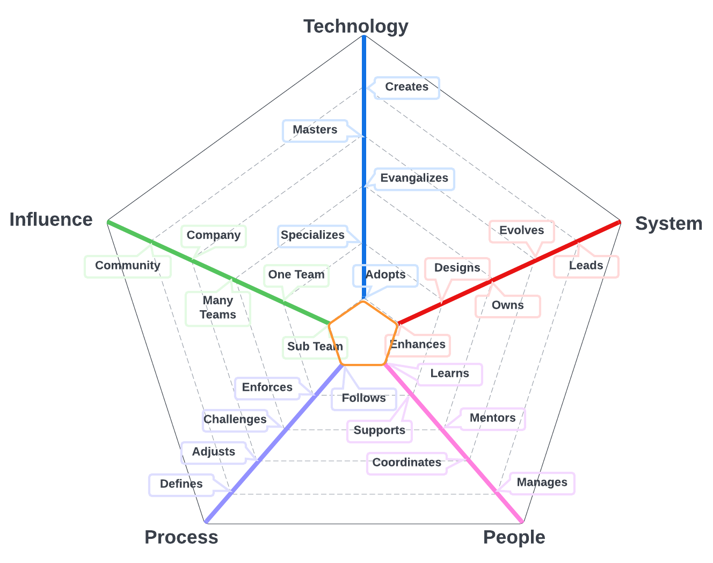
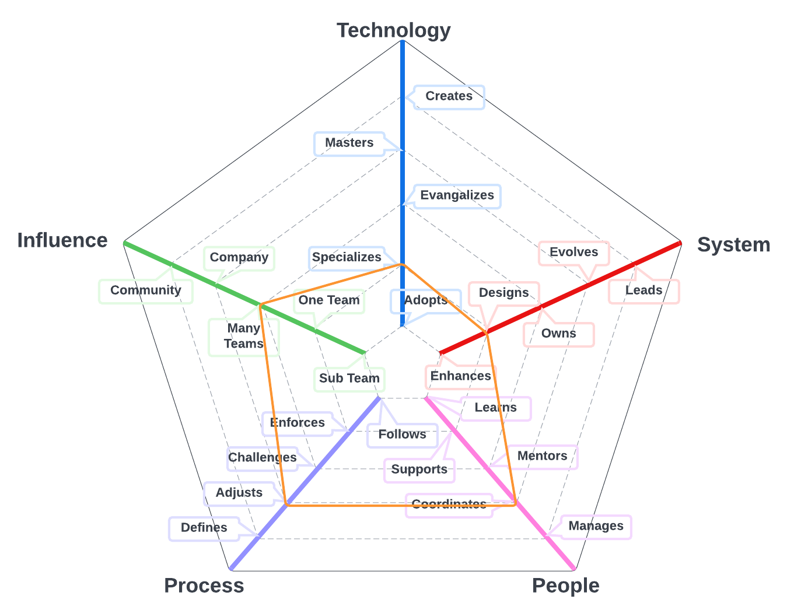

# Delivery Engineer
## Summary
Agile Project Manager and Delivery Engineer adept at utilizing a Kanban development process and data-driven decision-making to optimize project management. Recognizes the importance of metrics, KPIs, and feedback for continuous improvement and maintaining up-to-date process flows. Skilled in analyzing cycle time, lead time, and throughput to optimize workflows and monitor team performance. Facilitates regular meetings to promote collaboration, transparency, and alignment with business objectives. Expert in prioritization and managing WIP limits, ensuring focus on critical tasks and adjusting team capacity as needed. A continuous improvement advocate dedicated to enhancing efficiency in project delivery.

## Details
An Agile project manager, also known as a Delivery Engineer, who utilizes a Kanban development process, collects and utilizes data to effectively manage the project. This individual understands the importance of using metrics and feedback to make informed decisions and continually improve the process. They work closely with the development team to ensure that the Kanban board is up-to-date and that each task is accurately reflected in the process flow.

The Delivery Engineer uses a range of tools to collect and analyze data on key performance indicators (KPIs) such as cycle time, lead time, and throughput. They use this information to identify areas for improvement and make data-driven decisions to optimize the workflow. They also use metrics to monitor team performance and ensure that the team is meeting their targets and objectives.

The Agile project manager facilitates regular meetings with the team to promote collaboration and transparency. They use these meetings to provide feedback on the team's progress and identify any issues or challenges that need to be addressed. They also work closely with stakeholders to ensure that project goals are aligned with business objectives.

The Delivery Engineer understands the importance of prioritization and managing work in progress (WIP) limits to ensure that the team remains focused on the most critical tasks. They use data to identify when to adjust WIP limits and when to increase or decrease the team's capacity.

Overall, the Agile project manager, or Delivery Engineer, who collects and utilizes data to manage a Kanban development process is a data-driven decision-maker who is continuously seeking ways to improve the process and increase efficiency.

| Level | Position |
| :---: | :---: |
| 1 | [DE1 - Delivery Engineer 1](#de1---delivery-engineer-1) |
| 2 | [DE2 - Delivery Engineer 2](#de2---delivery-engineer-2) |
| 3 | [DE3 - Delivery Engineer 3](#de3---delivery-engineer-3) |
| 4 | [DE4 - Delivery Engineer 4](#de3---delivery-engineer-4) |

# System Specifics:
The system for Deliver Engineers is the way in which the company creates discipline around work, models it and manages it.
* **Technology**: Issue Management platforms like Jira, Agile development, Kanban, performance modeling (e.g., control charts, throughput) 
* **Process**: Work management processes, and progress reporting 

## DE1 - Delivery Engineer 1

* **[Technology](README.md#technology) - Adopts**
* **[System](README.md#technology) - Follows**
* **[People](README.md#people) - Learns**
* **[Process](README.md#process) - Follows**
* **[Influence](README.md#influence) - Sub Team**

## DE2 - Delivery Engineer 2

* **[Technology](README.md#technology) - Adopts**
* **[System](README.md#technology) - Designs**
* **[People](README.md#people) - Supports**
* **[Process](README.md#process) - Enforces**
* **[Influence](README.md#influence) - One Team**

## DE3 - Delivery Engineer 3

* **[Technology](README.md#technology) - Specializes**
* **[System](README.md#technology) - Designs**
* **[People](README.md#people) - Mentors**
* **[Process](README.md#process) - Challenges**
* **[Influence](README.md#influence) - Many Teams**

## DE4 - Delivery Engineer 4

* **[Technology](README.md#technology) - Specializes**
* **[System](README.md#technology) - Designs**
* **[People](README.md#people) - Coordinates**
* **[Process](README.md#process) - Adjusts**
* **[Influence](README.md#influence) - Many Teams**

# Also Known As
* Project Manager
* Project Administrator
* PM

# Other Pages
* [**Introduction**](README.md)
* [**Software Engineer**](Software-Engineer.md)
* [**Software Director**](Software-Director.md) 
* [**Quality Engineer**](Quality-Engineer.md)
* [**Quality Director**](Quality-Director.md)
* [**Delivery Engineer**](Delivery-Engineer.md)
* [**Delivery Director**](Delivery-Director.md)
* [**Product Engineer**](Product-Engineer.md)
* [**Product Director**](Product-Director.md)
* [**Engineering Director**](Engineering-Director.md)
* [**Software Director vs Engineering Support**](Comparison-Software-Director-Engineering-Director.md)
* [**Directing Directors**](Directing-Directors.md)__
