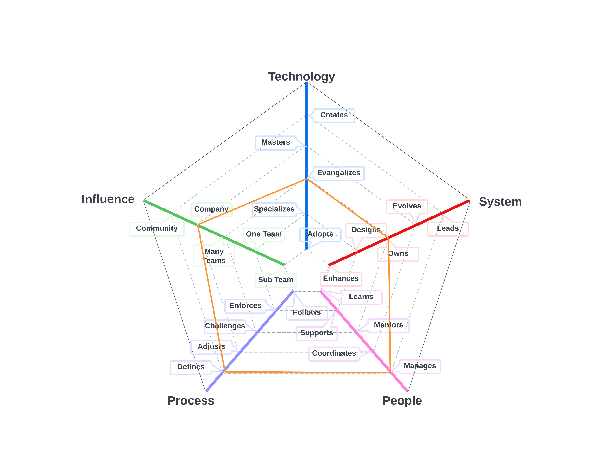
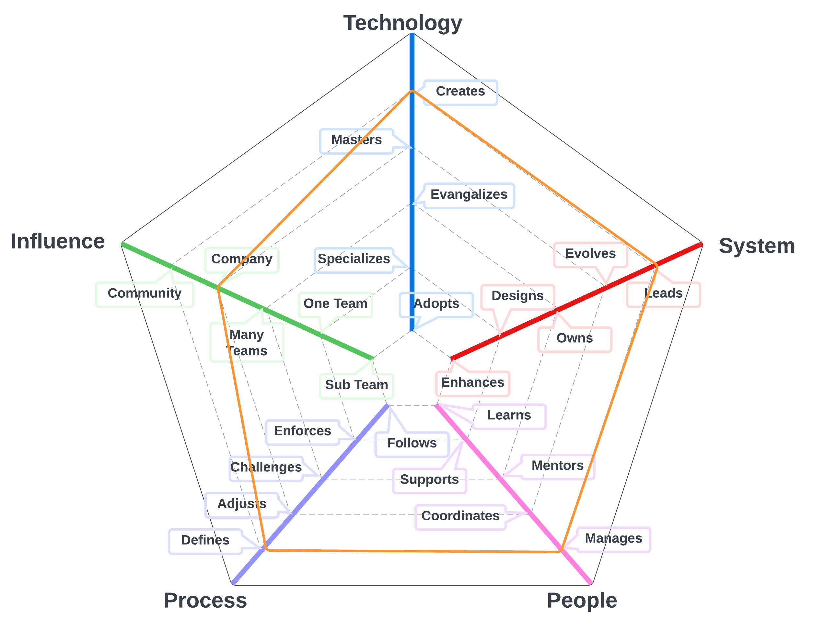

# Product Director

Role responsible for defining the strategic direction for products. They work with users, stakeholders, industry experts, market researchers, and perform research in order to define the best path forward for our products.

| Level | Position |
| :---: | :---: |
| 1 |  [PD1 - Product Director 1](#tpm1---product-director-1) |
| 2 |  [PD2 - Product Director 2](#tpm2---product-director-2) |
| 3 |  [PD3 - Product Director 3](#tpm3---product-director-3) |

# System Specifics:
The system for Product Directors is the way we define products for Layr, create product strategy, and collect product requirements 
* **Technology**: Issue Management platforms,  
* **Process**: requirements engineering processes, product strategy, release strategy

## PD1 - Product Director 1

* **[Technology](README.md#technology) - Specializes**
* **[System](README.md#technology) - Designs**
* **[People](README.md#people) - Coordinates**
* **[Process](README.md#process) - Adjusts**
* **[Influence](README.md#influence) - Many Teams**

## PD2 - Product Director 2

* **[Technology](README.md#technology) - Evangelizes**
* **[System](README.md#technology) - Evolves**
* **[People](README.md#people) - Manages**
* **[Process](README.md#process) - Defines**
* **[Influence](README.md#influence) - Many Teams**

## PD3 - Product Director 3

* **[Technology](README.md#technology) - Masters**
* **[System](README.md#technology) - Evolves**
* **[People](README.md#people) - Manages**
* **[Process](README.md#process) - Defines**
* **[Influence](README.md#influence) - Company**

# Other Pages
* [**Introduction**](README.md)
* [**Software Engineer**](Software-Engineer.md)
* [**Software Director**](Software-Director.md) 
* [**Quality Engineer**](Quality-Engineer.md)
* [**Quality Director**](Quality-Director.md)
* [**Delivery Engineer**](Delivery-Engineer.md)
* [**Delivery Director**](Delivery-Director.md)
* [**Product Engineer**](Product-Engineer.md)
* [**Product Director**](Product-Director.md)
* [**Engineering Director**](Engineering-Director.md)
* [**Software Director vs Engineering Support**](Comparison-Software-Director-Engineering-Director.md)
* [**Directing Directors**](Directing-Directors.md)