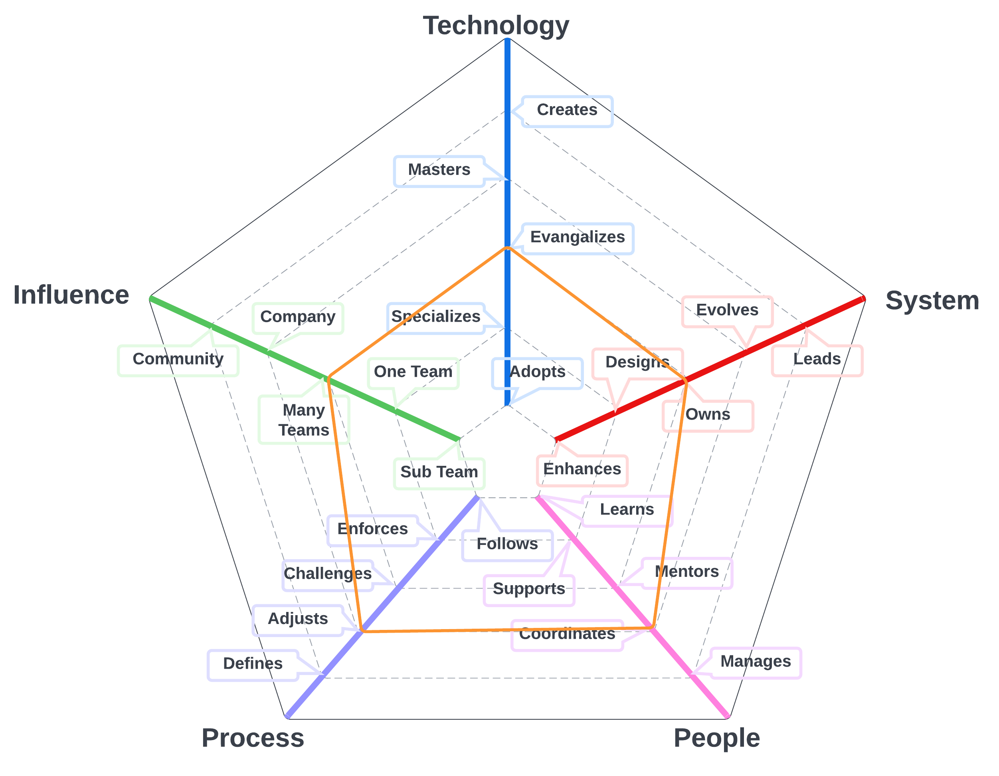

# Product Engineerimng Director
# Summary
Director of Product Engineering with expertise in guiding teams to deliver innovative, user-centric software products and applications. Fosters a culture of innovation and continuous improvement, streamlines product development processes, and mentors team members for professional growth. Proficient in embracing industry best practices and user-centered design principles, prioritizing product usability, scalability, and user experience. Committed to nurturing collaboration, promoting effective communication, and bridging the gap between technical and non-technical stakeholders for informed decision-making and organizational success.

## Details
Director of Product Engineering, a visionary leader and product development expert, adept at overseeing and guiding product engineering teams to deliver innovative, user-centric software products and applications. This strategic role involves collaborating with cross-functional teams, setting clear product objectives, and driving performance metrics to ensure the effective execution of product development processes and alignment with business goals.

Key responsibilities include fostering a culture of innovation and continuous improvement, ensuring efficient product development processes, and mentoring team members for professional growth. The Director of Product Engineering embraces industry best practices and user-centered design principles to maintain a competitive edge while prioritizing product usability, scalability, and user experience.

With a deep understanding of product development methodologies, the Director of Product Engineering is committed to nurturing a collaborative environment, promoting effective communication, and ensuring that software products and applications meet the highest standards of user satisfaction. This leader plays a pivotal role in bridging the gap between technical and non-technical stakeholders, facilitating informed decision-making, and contributing to the organization's overall success.

| Level | Position |
| :---: | :---: |
| 1 |  [PD1 - Product Director 1](#tpm1---product-director-1) |
| 2 |  [PD2 - Product Director 2](#tpm2---product-director-2) |
| 3 |  [PD3 - Product Director 3](#tpm3---product-director-3) |

# System Specifics:
The system for Product Directors is the way we define products for Layr, create product strategy, and collect product requirements 
* **Technology**: Issue Management platforms,  
* **Process**: requirements engineering processes, product strategy, release strategy

## PD1 - Product Director 1

* **[Technology](README.md#technology) - Specializes**
* **[System](README.md#technology) - Designs**
* **[People](README.md#people) - Coordinates**
* **[Process](README.md#process) - Adjusts**
* **[Influence](README.md#influence) - Many Teams**

## PD2 - Product Director 2

* **[Technology](README.md#technology) - Evangelizes**
* **[System](README.md#technology) - Evolves**
* **[People](README.md#people) - Manages**
* **[Process](README.md#process) - Defines**
* **[Influence](README.md#influence) - Many Teams**

## PD3 - Product Director 3

* **[Technology](README.md#technology) - Masters**
* **[System](README.md#technology) - Evolves**
* **[People](README.md#people) - Manages**
* **[Process](README.md#process) - Defines**
* **[Influence](README.md#influence) - Company**

# Other Pages
* [**Introduction**](README.md)
* [**Software Engineer**](Software-Engineer.md)
* [**Software Director**](Software-Director.md) 
* [**Quality Engineer**](Quality-Engineer.md)
* [**Quality Director**](Quality-Director.md)
* [**Delivery Engineer**](Delivery-Engineer.md)
* [**Delivery Director**](Delivery-Director.md)
* [**Product Engineer**](Product-Engineer.md)
* [**Product Director**](Product-Director.md)
* [**Engineering Director**](Engineering-Director.md)
* [**Software Director vs Engineering Support**](Comparison-Software-Director-Engineering-Director.md)
* [**Directing Directors**](Directing-Directors.md)
