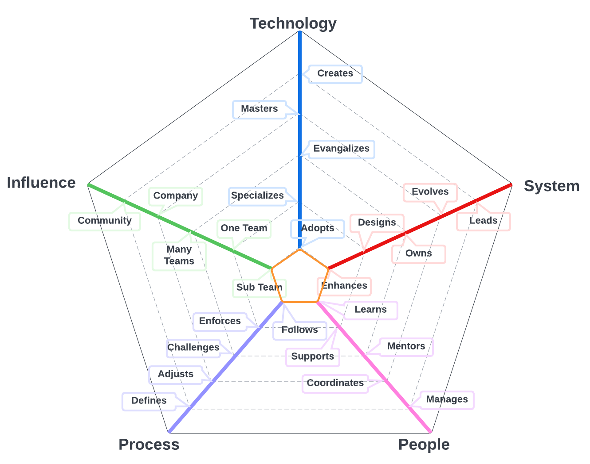
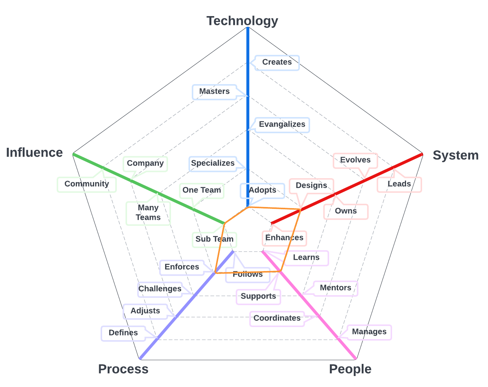
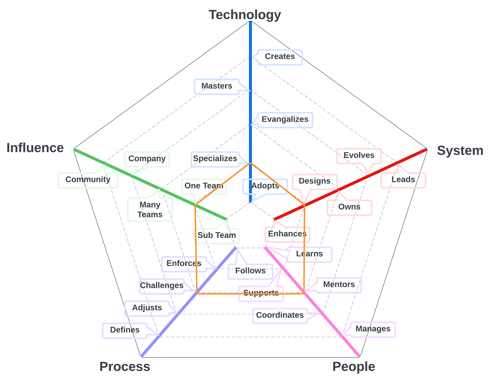
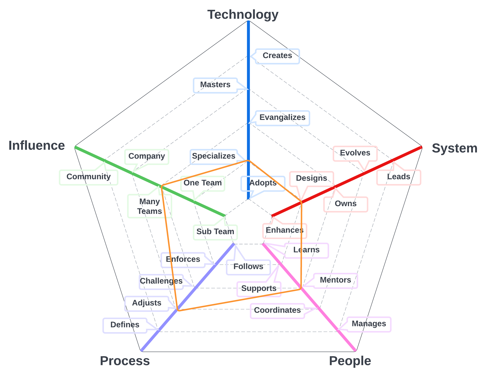

# Product Engineer

A Product Manager, also known as a Product Engineer, works closely with stakeholders to understand the business needs and translate them into detailed user stories that drive software engineering work. This individual takes a customer-centric approach to product development, ensuring that each feature and functionality aligns with the user's needs and preferences.

The Product Engineer is responsible for defining and prioritizing the product roadmap, working closely with stakeholders to ensure that product goals are aligned with business objectives. They also work closely with the software and qaulity engineering teams to ensure that each user story is clearly defined and that the team has a clear understanding of what needs to be built.

The Product Engineer also facilitates regular meetings with stakeholders to gather feedback and incorporate it into the product development process. They use customer feedback and data to continuously improve the product and ensure that it meets the needs of the user.

In addition, the Product Engineer works closely with the software and qaulity engineering teams to ensure that each user story is accurately reflected in the product backlog. They use Agile methodologies to prioritize and manage the backlog, ensuring that the team remains focused on the most critical tasks.

Overall, the Product Engineer is a customer-focused individual who works closely with stakeholders and the software and qaulity engineering teams to ensure that the product meets the needs of the user. They use data and feedback to continuously improve the product and drive software engineering work.

| Level | Position |
| :---: |  :---: |
| 1 | [RE1 - Product Engineer 1](#pe1---product-engineer-1) |
| 2 | [RE2 - Product Engineer 2](#pe2---product-engineer-2) |
| 3 | [RE3 - Product Engineer 3](#pe3---product-engineer-3) |
| 4 | [RE4 - Product Engineer 4](#pe4---product-engineer-4) |

# System Specifics:
The system for Product Engineers is the way we define products for Layr, create product strategy, and collect product requirements 
* **Technology**: Issue Management platforms,  
* **Process**: requirements engineering processes, product strategy, release strategy

## PE1 - Product Engineer 1

* **[Technology](README.md#technology) - Adopts**
* **[System](README.md#technology) - Enhances**
* **[People](README.md#people) - Learns**
* **[Process](README.md#process) - Follows**
* **[Influence](README.md#influence) - Sub Team**

## PE2 - Product Engineer 2

* **[Technology](README.md#technology) - Adopts**
* **[System](README.md#technology) - Designs**
* **[People](README.md#people) - Supports**
* **[Process](README.md#process) - Enforces**
* **[Influence](README.md#influence) - Sub Team**

## PE3 - Product Engineer 3

* **[Technology](README.md#technology) - Specializes**
* **[System](README.md#technology) - Designs**
* **[People](README.md#people) - Mentors**
* **[Process](README.md#process) - Challenges**
* **[Influence](README.md#influence) - Team**

## PE4 - Product Engineer 4

* **[Technology](README.md#technology) - Specializes**
* **[System](README.md#technology) - Designs**
* **[People](README.md#people) - Mentors**
* **[Process](README.md#process) - Adjusts**
* **[Influence](README.md#influence) - Multiple Teams**

# Other Pages
* [**Introduction**](README.md)
* [**Software Engineer**](Software-Engineer.md)
* [**Software Director**](Software-Director.md) 
* [**Quality Engineer**](Quality-Engineer.md)
* [**Quality Director**](Quality-Director.md)
* [**Delivery Engineer**](Delivery-Engineer.md)
* [**Delivery Director**](Delivery-Director.md)
* [**Product Engineer**](Product-Engineer.md)
* [**Product Director**](Product-Director.md)
* [**Engineering Director**](Engineering-Director.md)
* [**Software Director vs Engineering Support**](Comparison-Software-Director-Engineering-Director.md)
* [**Directing Directors**](Directing-Directors.md) 
