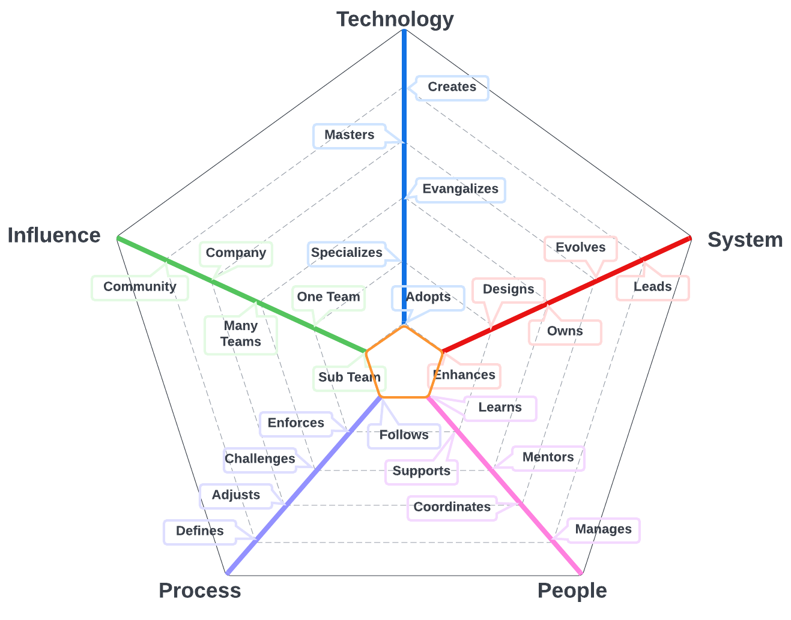
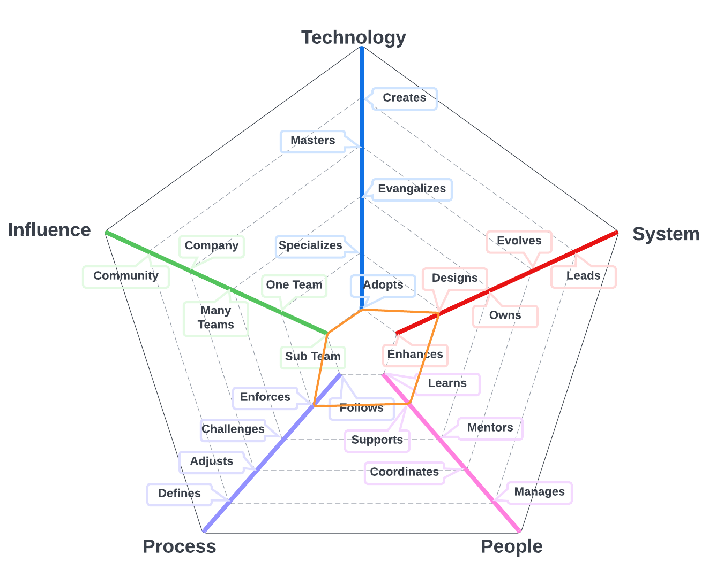
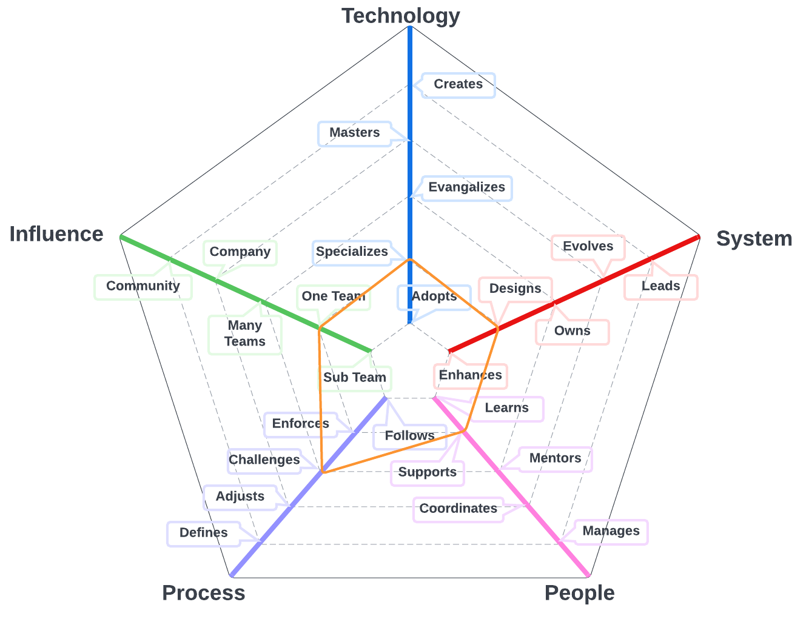

# Quality Engineer

A Quality Engineer is responsible for ensuring that the software product or application meets the highest quality standards. This individual utilizes tools like Cypress to create automated regression tests that maximize the quality of the customer's experience.

The Quality Engineer understands the importance of testing and validation to ensure that the software product or application meets customer expectations. They work closely with the development team to identify and fix any defects or issues that arise during the development process. They also work closely with the product manager to ensure that the product meets the needs of the customer.

The Quality Engineer uses Cypress, a popular testing tool, to create automated regression tests that validate the functionality and performance of the software product or application. They write detailed test scripts that cover all possible scenarios, ensuring that the product is thoroughly tested and validated.

In addition, the Quality Engineer uses data and analytics to continuously improve the testing process. They analyze test results to identify areas for improvement and optimize the testing process to maximize efficiency and effectiveness.

Overall, the Quality Engineer is a critical part of the software development process, ensuring that the software product or application meets the highest quality standards. They utilize tools like Cypress to create automated regression tests that maximize the quality of the customer's experience and continuously improve the testing process to drive quality and efficiency.

| Level |  Position |
| :---: |  :---: |
| 1 | [QE1 - Quality Engineer 1](#qe1---quality-engineer-1) |
| 2 | [QE2 - Quality Engineer 2](#qe2---quality-engineer-2) |
| 3 | [QE3 - Quality Engineer 3](#qe3---quality-engineer-3) |
| 4 | [QE4 - Quality Engineer 4](#qe4---quality-engineer-4) |

# System Specifics:
The system for Quality Engineers is how we ensure high quality experiences for our customers
* **Technology**: automated testing tools, code quality assessment tools 
* **Process**: quality engineering processes, quality assurance processes

## QE1 - Quality Engineer 1

* **[Technology](README.md#technology) - Adopts**
* **[System](README.md#technology) - Enhances**
* **[People](README.md#people) - Learns**
* **[Process](README.md#process) - Follows**
* **[Influence](README.md#influence) - Sub Team**

## QE2 - Quality Engineer 2

* **[Technology](README.md#technology) - Adopts**
* **[System](README.md#technology) - Enhances**
* **[People](README.md#people) - Learns**
* **[Process](README.md#process) - Follows**
* **[Influence](README.md#influence) - Sub Team**

## QE3 - Quality Engineer 3

* **[Technology](README.md#technology) - Specializes**
* **[System](README.md#technology) - Designs**
* **[People](README.md#people) - Supports**
* **[Process](README.md#process) - Challenges**
* **[Influence](README.md#influence) - Team**

## QE4 - Quality Engineer 4

* **[Technology](README.md#technology) - Evangelizes**
* **[System](README.md#technology) - Owns**
* **[People](README.md#people) - Mentors**
* **[Process](README.md#process) - Challenges**
* **[Influence](README.md#influence) - Team**

# Also Known As
* Quality Assurance
* QA
* Tester

# Other Pages
* [**Introduction**](README.md)
* [**Software Engineer**](Software-Engineer.md)
* [**Software Director**](Software-Director.md) 
* [**Quality Engineer**](Quality-Engineer.md)
* [**Quality Director**](Quality-Director.md)
* [**Delivery Engineer**](Delivery-Engineer.md)
* [**Delivery Director**](Delivery-Director.md)
* [**Product Engineer**](Product-Engineer.md)
* [**Product Director**](Product-Director.md)
* [**Engineering Director**](Engineering-Director.md)
* [**Software Director vs Engineering Support**](Comparison-Software-Director-Engineering-Director.md)
* [**Directing Directors**](Directing-Directors.md)
