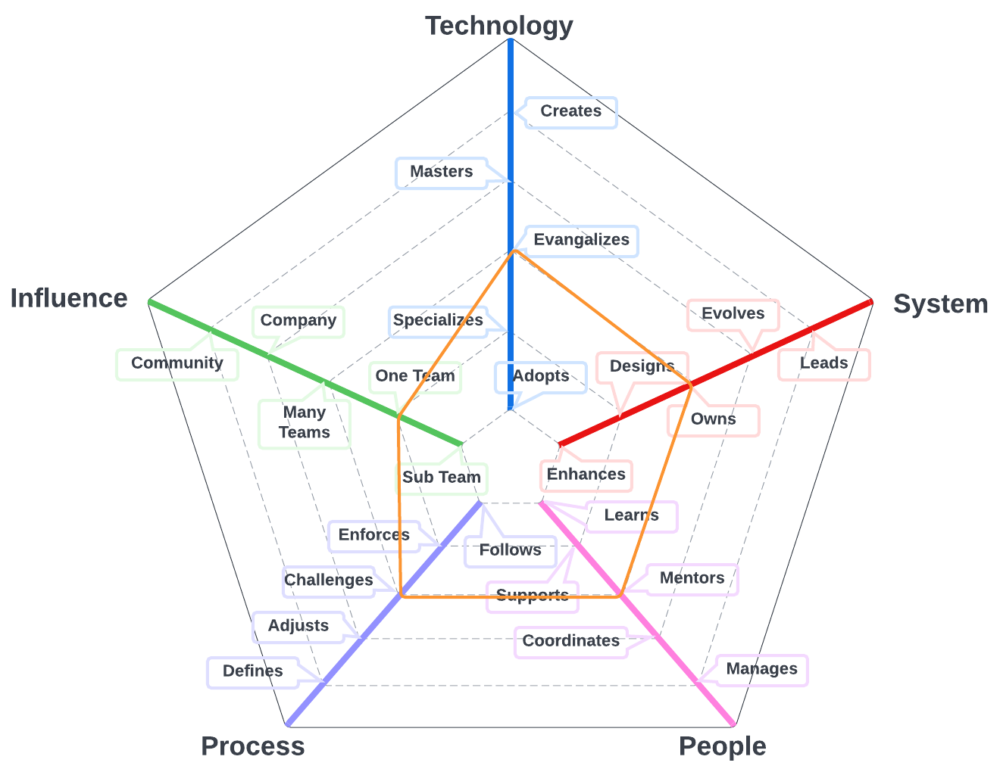

# Quality Engineer

The primary system for team members on this path is the quality program and includes automated regression tests for UI's and API's and related tools that we use to create a high quality experience for our customers. 

| Level |  Position |
| :---: |  :---: |
| 1 | [QE1 - Quality Engineer 1](#qe1---quality-engineer-1) |
| 2 | [QE2 - Quality Engineer 2](#qe2---quality-engineer-2) |
| 3 | [QE3 - Quality Engineer 3](#qe3---quality-engineer-3) |
| 4 | [QE4 - Quality Engineer 4](#qe4---quality-engineer-4) |

# System Specifics:
The system for Quality Engineers is how we ensure high quality experiences for our customers
* **Technology**: automated testing tools, code quality assessment tools 
* **Process**: quality engineering processes, quality assurance processes

## QE1 - Quality Engineer 1

* **[Technology](README.md#technology) - Adopts**
* **[System](README.md#technology) - Enhances**
* **[People](README.md#people) - Learns**
* **[Process](README.md#process) - Follows**
* **[Influence](README.md#influence) - Sub Team**

## QE2 - Quality Engineer 2

* **[Technology](README.md#technology) - Adopts**
* **[System](README.md#technology) - Enhances**
* **[People](README.md#people) - Learns**
* **[Process](README.md#process) - Follows**
* **[Influence](README.md#influence) - Sub Team**

## QE3 - Quality Engineer 3

* **[Technology](README.md#technology) - Specializes**
* **[System](README.md#technology) - Designs**
* **[People](README.md#people) - Supports**
* **[Process](README.md#process) - Challenges**
* **[Influence](README.md#influence) - Team**

## QE4 - Quality Engineer 4

* **[Technology](README.md#technology) - Evangelizes**
* **[System](README.md#technology) - Owns**
* **[People](README.md#people) - Mentors**
* **[Process](README.md#process) - Challenges**
* **[Influence](README.md#influence) - Team**

# Also Known As
* Quality Assurance
* QA
* Tester

# Other Pages
* [**Introduction**](README.md)
* [**Software Engineer**](Software-Engineer.md)
* [**Software Director**](Software-Director.md) 
* [**Quality Engineer**](Quality-Engineer.md)
* [**Quality Director**](Quality-Director.md)
* [**Delivery Engineer**](Delivery-Engineer.md)
* [**Delivery Director**](Delivery-Director.md)
* [**Product Engineer**](Product-Engineer.md)
* [**Product Director**](Product-Director.md)
* [**Engineering Director**](Engineering-Director.md)
* [**Software Director vs Engineering Support**](Comparison-Software-Director-Engineering-Director.md)
* [**Directing Directors**](Directing-Directors.md)