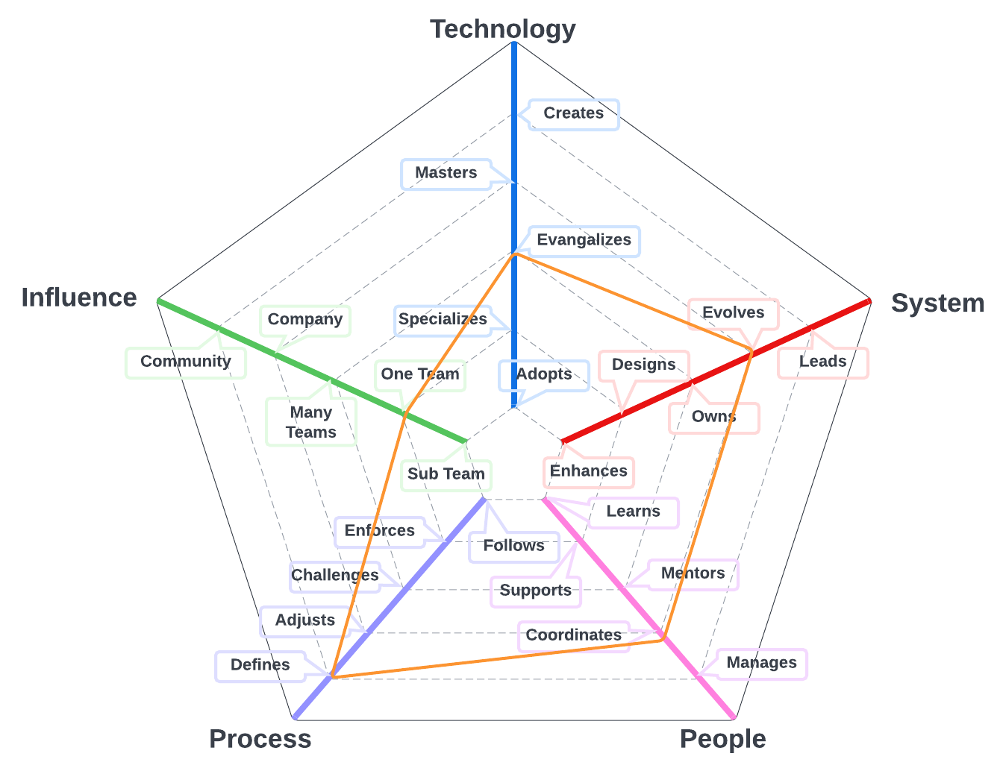
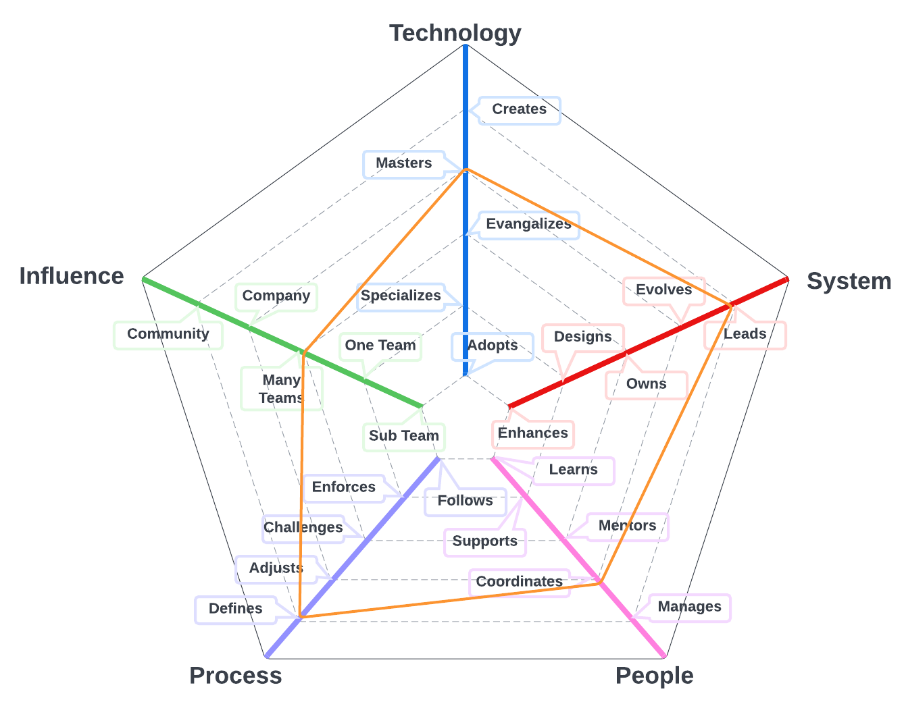
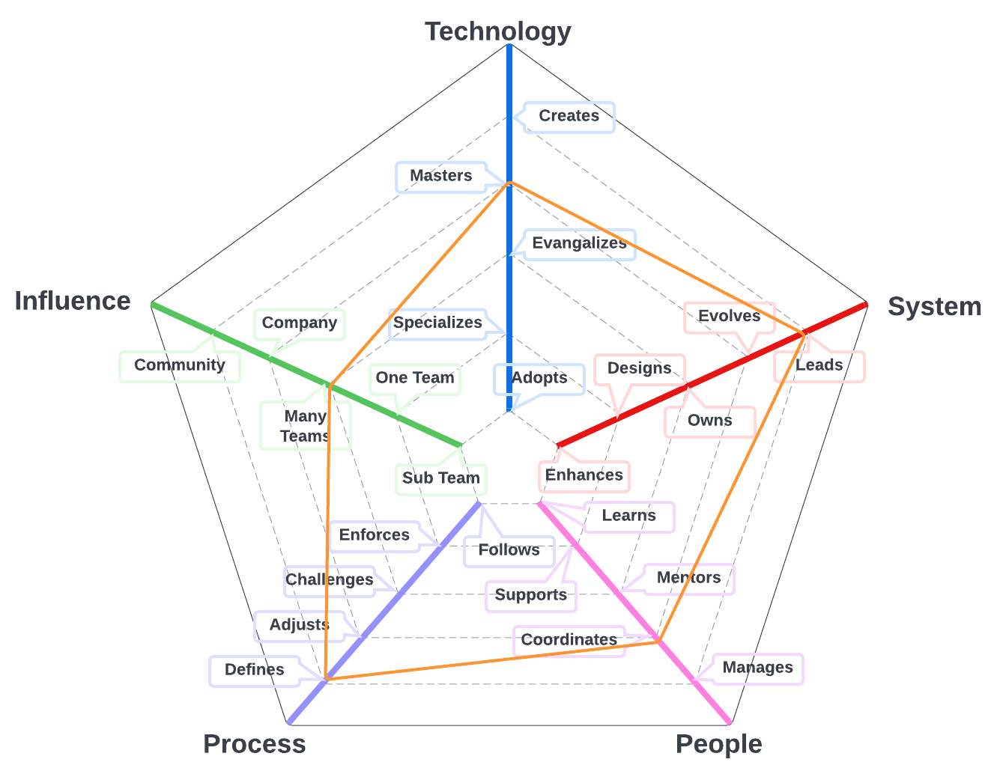

# Software Director
## Summary
Director of Software Engineering with expertise in guiding teams to deliver innovative, high-quality software solutions aligned with business goals. Fosters a culture of innovation and continuous improvement, streamlines processes, and mentors team members for professional growth. Proficient in embracing emerging technologies, industry best practices, and prioritizing scalability, security, and user experience. Committed to nurturing collaboration, promoting effective communication, and bridging the gap between technical and non-technical stakeholders for informed decision-making and organizational success.
## Details
Director of Software Engineering, a seasoned leader and technical expert, adept at overseeing and guiding software development teams to deliver innovative, high-quality, and reliable software solutions. This strategic role involves collaborating with cross-functional teams, setting clear objectives, and driving performance metrics to ensure the effective execution of projects and alignment with business goals.

Key responsibilities include fostering a culture of innovation and continuous improvement, ensuring efficient software development processes, and mentoring team members for professional growth. The Director of Software Engineering embraces emerging technologies and industry best practices to maintain a competitive edge while prioritizing scalability, security, and user experience.

With a deep understanding of software development methodologies, the Director of Software Engineering is committed to nurturing a collaborative environment, promoting effective communication, and ensuring that projects are completed on time and within budget. This leader plays a pivotal role in bridging the gap between technical and non-technical stakeholders, facilitating informed decision-making, and contributing to the organization's overall success.

| Level | Position |
| :---: | :---: |
| 1 | [SD1 - Software Director 1](#sd1---software-director-1) |
| 2 | [SD2 - Software Director 2](#sd2---software-director-2) |
| 3 | [SD3 - Software Director 3](#sd3---software-director-3) |

# System Specifics:
The system for Software Directors is everything necessary to build and run Layr software applications
* **Technology**: GitHub, cloud infrastructure, application programming languages, infrastructure programming languages, etc   
* **Process**: coding practices, build processes, peer review processes

## SD1 - Software Director 1

* **[Technology](README.md#technology) - Evangelizes**
* **[System](README.md#technology) - Evolves**
* **[People](README.md#people) - Coordinates**
* **[Process](README.md#process) - Defines**
* **[Influence](README.md#influence) - Team**

## SD2 - Software Director 2

* **[Technology](README.md#technology) - Masters**
* **[System](README.md#technology) - Leads**
* **[People](README.md#people) - Coordinates**
* **[Process](README.md#process) - Defines**
* **[Influence](README.md#influence) - Multiple Teams**

## SD3 - Software Director 3

* **[Technology](README.md#technology) - Masters**
* **[System](README.md#technology) - Leads**
* **[People](README.md#people) - Coordinates**
* **[Process](README.md#process) - Defines**
* **[Influence](README.md#influence) - Company**

# Also Known As
* Technical Lead
* Tech Lead
* Development Lead
* Architect

# Other Pages
* [**Introduction**](README.md)
* [**Software Engineer**](Software-Engineer.md)
* [**Software Director**](Software-Director.md) 
* [**Quality Engineer**](Quality-Engineer.md)
* [**Quality Director**](Quality-Director.md)
* [**Delivery Engineer**](Delivery-Engineer.md)
* [**Delivery Director**](Delivery-Director.md)
* [**Product Engineer**](Product-Engineer.md)
* [**Product Director**](Product-Director.md)
* [**Engineering Director**](Engineering-Director.md)
* [**Software Director vs Engineering Support**](Comparison-Software-Director-Engineering-Director.md)
* [**Directing Directors**](Directing-Directors.md)
