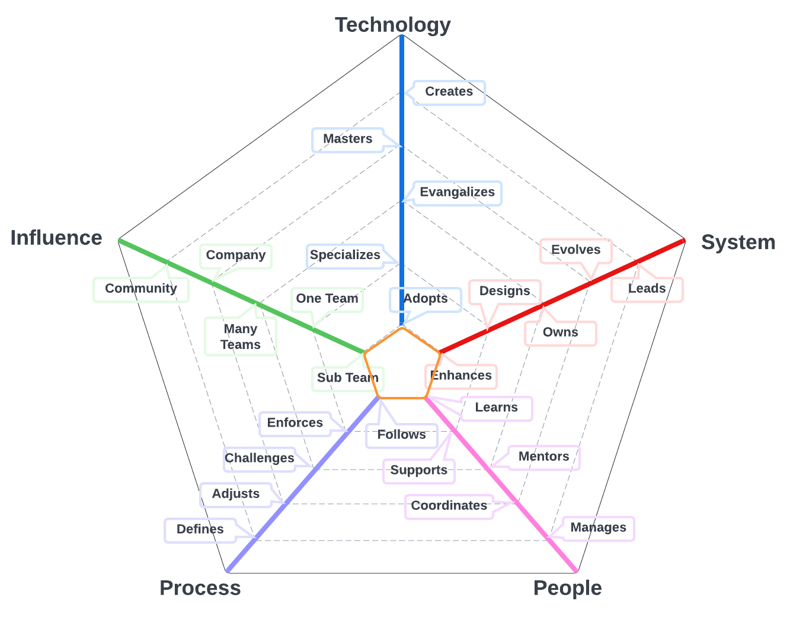
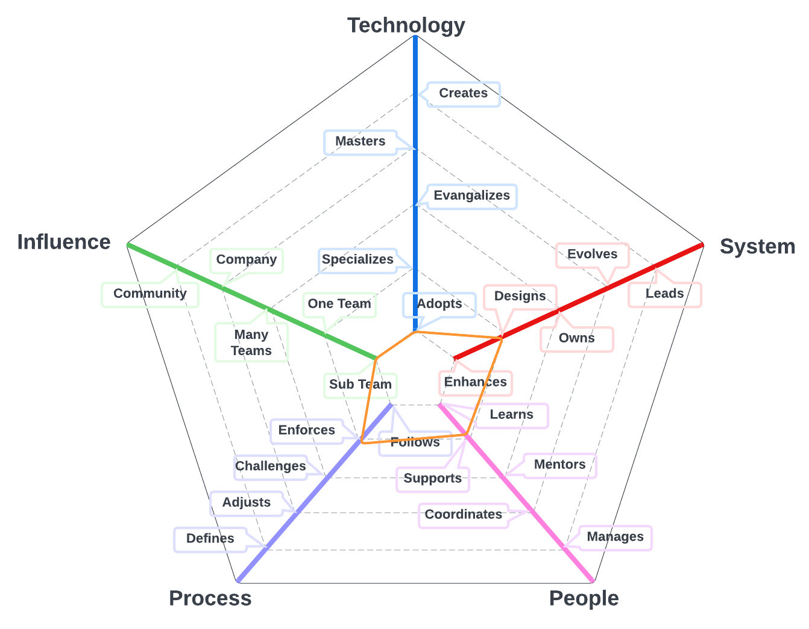
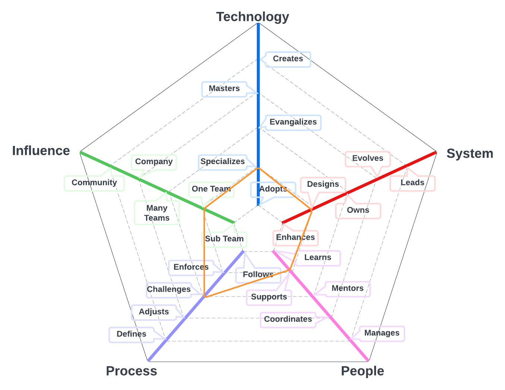
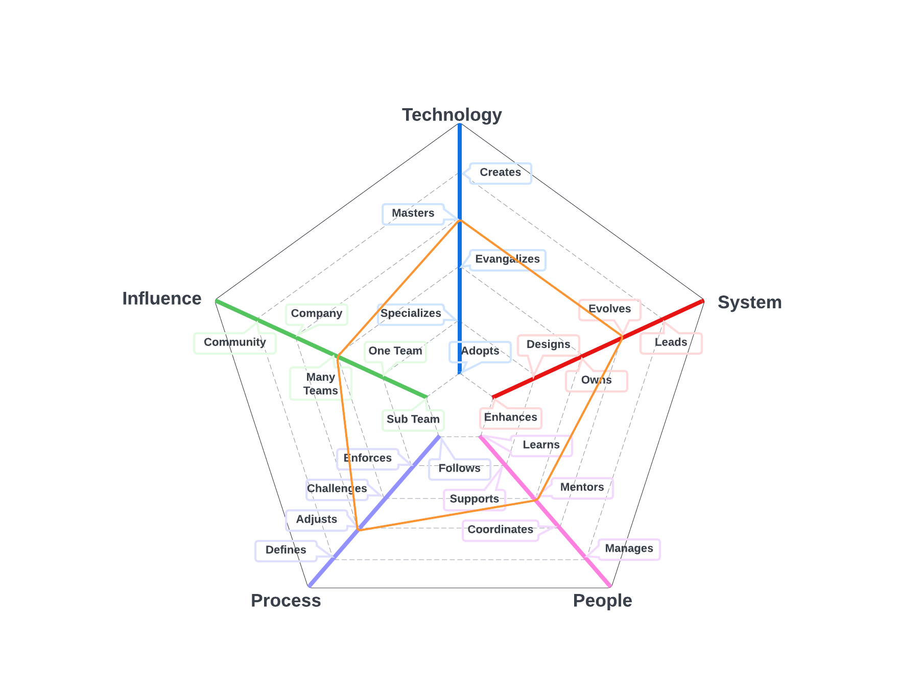
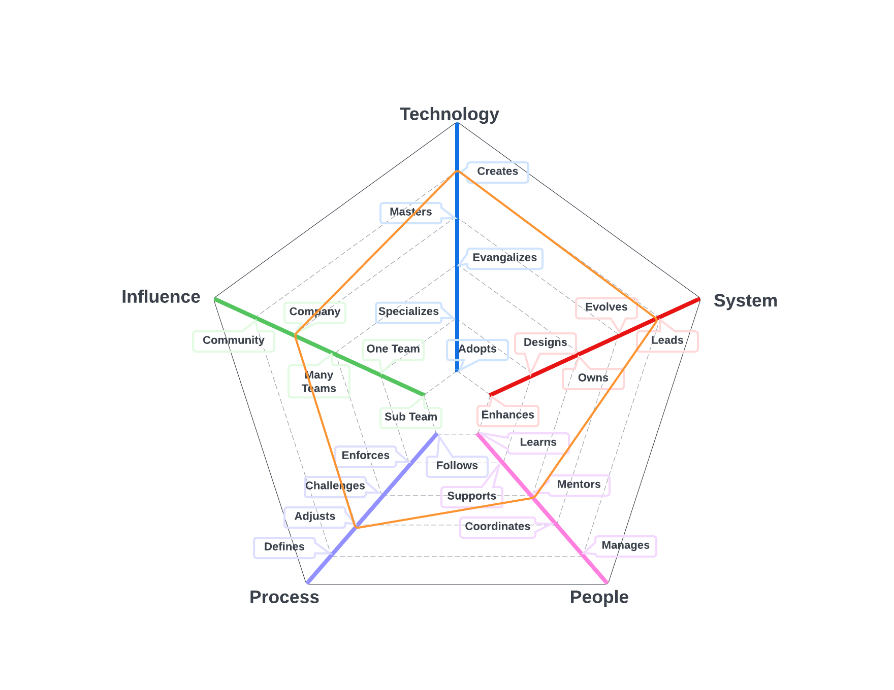
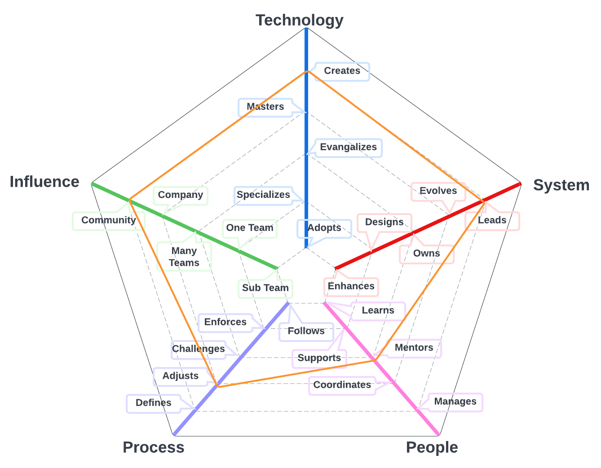

# Software Engineer

A Software Engineer who utilizes TypeScript and AWS services creates high-quality experiences for customers using Lambda microservice architectures. This individual has a deep understanding of TypeScript, a strongly-typed programming language that enables the creation of robust and reliable applications. They use TypeScript to write clean and maintainable code that is easy to understand and modify.

The Software Engineer also has expertise in AWS services, which they use to build scalable and resilient microservices. They use AWS Lambda to create serverless functions that run on-demand and scale automatically based on traffic and usage patterns. They also utilize other AWS services such as API Gateway, DynamoDB, and S3 to create a fully-functional microservice architecture.

The Software Engineer takes a customer-centric approach to software development, ensuring that each microservice meets the needs of the user. They work closely with the product manager to understand the customer requirements and create software solutions that align with business objectives.

In addition, the Software Engineer understands the importance of testing and validation to ensure that the software product or application meets the highest quality standards. They write unit tests, integration tests, and end-to-end tests to validate the functionality and performance of each microservice.

Overall, the Software Engineer who utilizes TypeScript and AWS services to create high-quality experiences for customers using Lambda microservice architectures is a critical part of the software development process. They use their expertise to create reliable, scalable, and resilient applications that meet the needs of the user and drive business success.

| Level | Position |
| :---: | :---: |
| 1 | [SE - Software Engineer 1](#se1---software-engineer-1) |
| 2 | [SE - Software Engineer 2](#se2---software-engineer-2) |
| 3 | [SE - Software Engineer 3](#se3---software-engineer-3) |
| 4 | [SE - Software Engineer 4](#se4---software-engineer-4) |
| 5 | [SE - Software Engineer 5](#se5---software-engineer-5) |
| 6 | [SE - Software Engineer 6](#se6---software-engineer-6) |
| 7 | [SE - Software Engineer 7](#se7---software-engineer-7) |

# System Specifics:
The system for Software Engineers is everything necessary to build and run Layr software applications
* **Technology**: GitHub, cloud infrastructure, application programming languages, infrastructure programming languages, etc   
* **Process**: coding practices, build processes, peer review processes

## SE1 - Software Engineer 1

* **[Technology](README.md#technology) - Adopts**
* **[System](README.md#technology) - Enhances**
* **[People](README.md#people) - Learns**
* **[Process](README.md#process) - Follows**
* **[Influence](README.md#influence) - Sub Team**

## SE2 - Software Engineer 2

* **[Technology](README.md#technology) - Adopts**
* **[System](README.md#technology) - Designs**
* **[People](README.md#people) - Supports**
* **[Process](README.md#process) - Enforces**
* **[Influence](README.md#influence) - Sub Team**

## SE3 - Software Engineer 3

* **[Technology](README.md#technology) - Specializes**
* **[System](README.md#technology) - Designs**
* **[People](README.md#people) - Supports**
* **[Process](README.md#process) - Challenges**
* **[Influence](README.md#influence) - Team**

## SE4 - Software Engineer 4

* **[Technology](README.md#technology) - Evangelizes**
* **[System](README.md#technology) - Owns**
* **[People](README.md#people) - Mentors**
* **[Process](README.md#process) - Challenges**
* **[Influence](README.md#influence) - Team**

## SE5 - Software Engineer 5

* **[Technology](README.md#technology) - Masters**
* **[System](README.md#technology) - Evolves**
* **[People](README.md#people) - Mentors**
* **[Process](README.md#process) - Adjusts**
* **[Influence](README.md#influence) - Multiple Teams**

## SE6 - Software Engineer 6

* **[Technology](README.md#technology) - Creates**
* **[System](README.md#technology) - Leads**
* **[People](README.md#people) - Mentors**
* **[Process](README.md#process) - Adjusts**
* **[Influence](README.md#influence) - Company**

## SE7 - Software Engineer 7

* **[Technology](README.md#technology) - Creates**
* **[System](README.md#technology) - Leads**
* **[People](README.md#people) - Mentors**
* **[Process](README.md#process) - Adjusts**
* **[Influence](README.md#influence) - Community**

# Also Known As
* Software Developer
* Developer

# Other Pages
* [**Introduction**](README.md)
* [**Software Engineer**](Software-Engineer.md)
* [**Software Director**](Software-Director.md) 
* [**Quality Engineer**](Quality-Engineer.md)
* [**Quality Director**](Quality-Director.md)
* [**Delivery Engineer**](Delivery-Engineer.md)
* [**Delivery Director**](Delivery-Director.md)
* [**Product Engineer**](Product-Engineer.md)
* [**Product Director**](Product-Director.md)
* [**Engineering Director**](Engineering-Director.md)
* [**Software Director vs Engineering Support**](Comparison-Software-Director-Engineering-Director.md)
* [**Directing Directors**](Directing-Directors.md)
